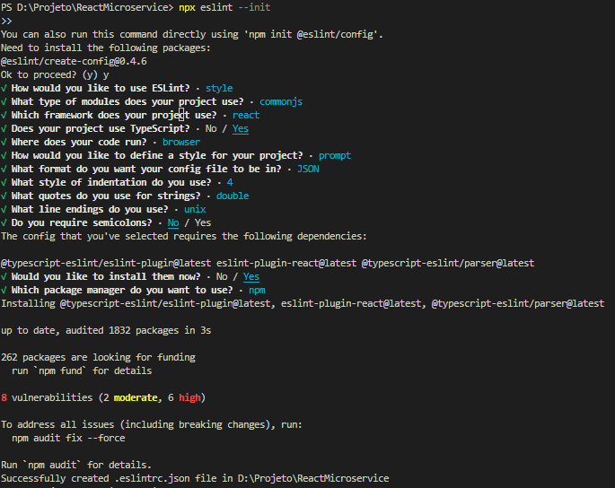

#  ESLint é um linter

O ESLint é uma ferramenta de linting extremamente popular e amplamente utilizada na comunidade de desenvolvimento JavaScript/TypeScript. Sua principal finalidade é identificar e corrigir problemas no código, seguindo um conjunto de regras e boas práticas definidas pelo desenvolvedor ou pela equipe.

### Por que usar o ESLint?

- Identificação de problemas de código: O ESLint ajuda a identificar erros, más práticas e padrões não recomendados no código JavaScript/TypeScript, como variáveis não utilizadas, falta de ponto e vírgula, indentação inconsistente, etc.
- Padronização do código: Permite estabelecer e manter um estilo de código consistente entre todos os membros da equipe, independentemente do número de desenvolvedores.
- Evita bugs e problemas futuros: Ao detectar problemas potenciais durante o desenvolvimento, o ESLint ajuda a prevenir bugs antes mesmo de o código ser executado.
- Melhora a legibilidade e a manutenibilidade: Ao seguir regras de boas práticas, o código tende a ser mais legível e mais fácil de manter, especialmente em projetos maiores e de longo prazo.
- Personalização das regras: Oferece a capacidade de personalizar regras, permitindo que os desenvolvedores adaptem as configurações do ESLint de acordo com as necessidades específicas do projeto ou da equipe.

### Instalação do ESLint:

```
npm install eslint --save-dev
```

- npm install: Comando para instalar pacotes do Node.js.
- eslint: É o pacote do ESLint que será instalado no projeto.
- --save-dev: Isso indica que o pacote será instalado como uma dependência de desenvolvimento, ou seja, será usado apenas durante o desenvolvimento do projeto, não em produção.

### Exemplo de configuração ao instalar do eslint



### Instalação do Parser e Plugin do TypeScript para ESLint:

```
npm install @typescript-eslint/parser @typescript-eslint/eslint-plugin eslint-plugin-solid --save-dev
```

- @typescript-eslint/parser: Este pacote permite que o ESLint analise o código TypeScript.
- @typescript-eslint/eslint-plugin: É um plugin que contém regras específicas do ESLint para TypeScript.
- eslint-plugin-solid: Contém regras de linting especializadas para Solid no ESLint

### Instalação do Plugin do React para ESLint:

```
npm install eslint-plugin-react --save-dev
```

- eslint-plugin-react: É um plugin que contém regras específicas do ESLint para o React.

