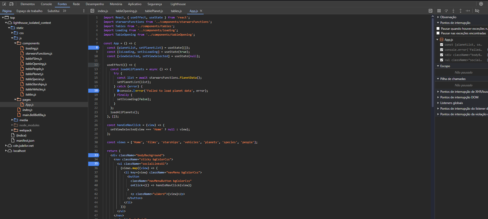
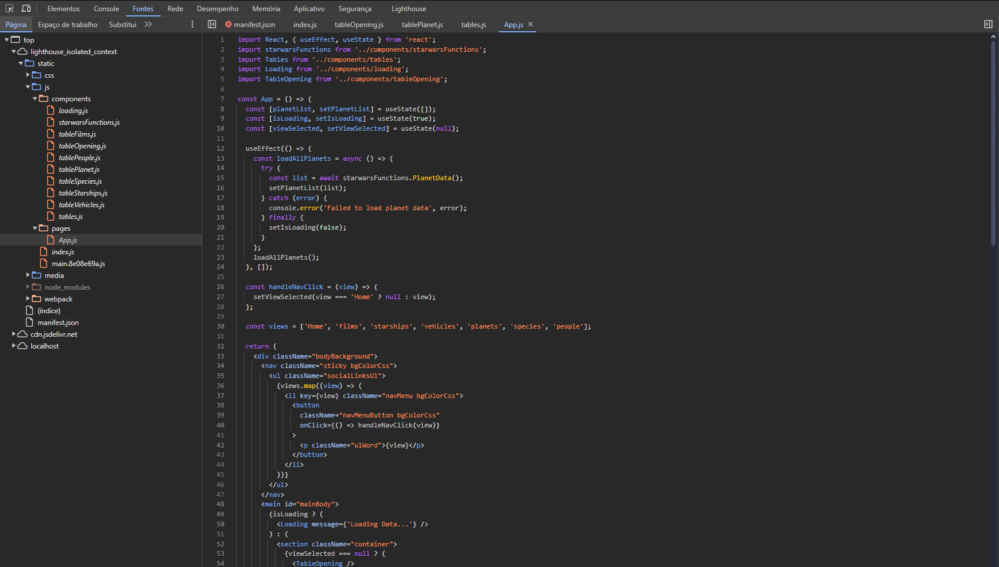

# Guia Prático de Debugging: A Arte de Resolver Problemas no Frontend

Bem-vindo ao nosso post sobre "Guia Prático de Debugging: A Arte de Resolver Problemas no Frontend"! Neste artigo, exploraremos os aspectos essenciais do desenvolvimento frontend, com foco em técnicas de debugging, melhores práticas de codificação e garantia de segurança da aplicação. Forneceremos um tutorial detalhado sobre o uso do Google Chrome DevTools—uma ferramenta indispensável para depuração, análise de performance e otimização de aplicações web. Este guia foi elaborado para ser um recurso valioso tanto para iniciantes quanto para desenvolvedores experientes, ajudando você a identificar e resolver problemas de forma eficiente em seus projetos frontend. Ao dominar essas técnicas, você aprimorará sua capacidade de entregar código de alta qualidade, seguro e sustentável.

## 2. Identificação de Bugs

### 2.1 Compreendendo as Mensagens de Erro

As mensagens de erro geralmente contêm informações cruciais, como:

- **Tipo do erro**: Exemplo: TypeError, ReferenceError, etc.
- **Descrição**: Detalhes sobre o que deu errado.
- **Localização**: O arquivo e a linha onde o erro ocorreu.

Compreender corretamente essas mensagens é essencial para determinar o próximo passo na solução.

### 2.2 Uso do Console do Navegador

O console do navegador, acessado via F12, é uma ferramenta poderosa para depuração. Ele permite:

- **Visualização de erros**: Exibe todos os erros e avisos que ocorrem na página.
- **Execução de comandos**: Permite testar código diretamente no console para verificar o comportamento de funções ou variáveis.
- **Monitoramento de rede**: A aba "Network" permite verificar requisições HTTP, suas respostas, e possíveis erros de comunicação.

### 2.3 Debugging no Navegador

Os navegadores modernos possuem ferramentas robustas para debugging, acessíveis através do DevTools (F12), que incluem:

- **Console**: Para visualizar logs, erros, e executar código JavaScript em tempo real.
- **Sources**: Para inspecionar e depurar arquivos de código.
- **Network**: Para monitorar e analisar requisições de rede.
- **Application**: Para inspecionar armazenamento local, cookies, e outros recursos da aplicação.

### 2.4 Debugging de JavaScript

- **Uso de Breakpoints**: Breakpoints são pontos no código onde a execução é interrompida, permitindo inspecionar o estado atual da aplicação.
  - Para definir um breakpoint, abra o DevTools (F12), navegue até a aba Sources, localize o arquivo JavaScript desejado e clique no número da linha onde deseja pausar a execução.
- **Analisando Variáveis e Funções**: Com o código pausado em um breakpoint, você pode:
  - Hover sobre variáveis para ver seus valores atuais.
  - Usar a aba Scope para ver o contexto das variáveis disponíveis.
  - Avançar a execução linha por linha usando o botão de "Step Over" ou "Step Into".
- **Debugging Condicional**: Para focar em situações específicas, como quando uma variável assume um valor inesperado:
  - Clique com o botão direito na linha onde deseja adicionar o breakpoint.
  - Selecione "Add conditional breakpoint" e insira a condição.

### 2.5 Debugging em Aplicações React

Aplicações React introduzem camadas adicionais de complexidade, mas há ferramentas específicas para debugging:

- **React Developer Tools**: Uma extensão de navegador que permite:
  - Inspecionar a árvore de componentes.
  - Debugging de estado: Monitorar mudanças no estado e nas props em tempo real.
- **Debugging de Hooks**: O React Developer Tools facilita a inspeção do estado dos hooks dentro de componentes funcionais.

## 3. Boas Práticas de Desenvolvimento

### 3.1 Clareza e Manutenção do Código

Um código bem estruturado facilita a identificação de problemas e a manutenção futura. Algumas práticas recomendadas incluem:

- **Nomes de variáveis e funções descritivos**: Escolha nomes que deixem claro o propósito daquela variável ou função.
- **Comentários úteis**: Documente trechos de código complexos ou decisões arquiteturais importantes.
- **Consistência**: Mantenha um estilo de código consistente, usando ferramentas como ESLint ou Prettier.

### 3.2 Evite "Gambiarras"

Soluções temporárias podem se tornar problemas futuros difíceis de resolver. Priorize sempre uma solução completa e sustentável.

## 4. Importância dos Testes Unitários

### 4.1 O Que São Testes Unitários?

Testes unitários são testes automatizados que verificam se partes individuais do seu código (unidades) estão funcionando como esperado. Eles ajudam a identificar problemas antes mesmo que o código seja integrado à aplicação principal.

### 4.2 Como os Testes Ajudam na Identificação de Bugs

Ao cobrir seu código com testes unitários, você garante que novas mudanças não introduzam bugs. Se um teste falha, você imediatamente sabe onde e o que deu errado, facilitando a correção.

### 4.3 Ferramentas para Testes Unitários

Existem várias bibliotecas populares para testes unitários no desenvolvimento front-end, como:

- **Jest**: Amplamente usado com React.
- **Mocha/Chai**: Popular para testes em projetos JavaScript em geral.
- **Cypress**: Para testes end-to-end, que também ajudam na cobertura de funcionalidades.

## 5. Segurança no Desenvolvimento

### 5.1 Importância da Segurança

A segurança deve ser uma preocupação constante no desenvolvimento front-end. Vulnerabilidades podem ser exploradas, comprometendo dados dos usuários e a integridade da aplicação.

### 5.2 Práticas de Segurança

- **Validação de entrada**: Nunca confie cegamente nos dados fornecidos pelo usuário. Sempre faça validações tanto no front-end quanto no back-end.
- **Sanitização de dados**: Limpe e trate dados de entrada para prevenir ataques como XSS (Cross-Site Scripting).
- **Uso de HTTPS**: Garanta que toda a comunicação entre o cliente e o servidor seja feita de forma segura usando HTTPS.

### 5.3 Monitoramento de Vulnerabilidades

Mantenha suas dependências sempre atualizadas e use ferramentas como Snyk ou npm audit para monitorar e corrigir vulnerabilidades conhecidas.

## 6. Uso do Google Chrome DevTools

### 6.1 Breakpoint Toolbar

#### 6.1.1 O que são Breakpoints?

Breakpoints são pontos no código onde a execução é interrompida, permitindo que você inspecione o estado atual da aplicação.

#### 6.1.2 Como Usar Breakpoints

Para usar breakpoints:

- Acesse o DevTools: Pressione F12 ou Ctrl + Shift + I (Windows/Linux) ou Cmd + Option + I (Mac).
- Vá para a aba Sources.
- Encontre o arquivo JavaScript que você deseja depurar.
- Clique no número da linha onde você deseja adicionar um breakpoint.

#### 6.1.3 Breakpoint Toolbar

Atalhos para a Breakpoint Toolbar:

- **Resume Script Execution**: F8
- **Step Over (Ignorar Funções)**: F10
- **Step Into (Entrar na Função)**: F11
- **Step Out (Sair da Função)**: Shift + F11
- **Deactivate Breakpoints**: Não possui um atalho padrão, mas você pode clicar no ícone de "Toggle Breakpoints" na barra de ferramentas.

### 6.2 Sources Tab

#### 6.2.1 Navegando pelos Arquivos

Na aba Sources, explore todos os arquivos carregados pela página.

Atalhos principais:

- **Abrir arquivo rapidamente**: Ctrl + P (Windows/Linux) ou Cmd + P (Mac)
- **Pesquisar no arquivo**: Ctrl + F (Windows/Linux) ou Cmd + F (Mac)
- **Navegar pelos Breakpoints**: Ctrl + Shift + B (Windows/Linux) ou Cmd + Shift + B (Mac)

#### 6.2.2 Usando Breakpoints Condicionais

Para adicionar breakpoints condicionais:

- **Adicionar Conditional Breakpoint**: Clique com o botão direito na linha desejada e selecione "Add Conditional Breakpoint".
- **Atalho para abrir o menu contextual**: Shift + F10 (Windows/Linux)

### 6.3 Network Tab

#### 6.3.1 Monitorando Requisições HTTP

Na aba Network, monitore todas as requisições que a página faz.

Atalhos principais:

- **Recarregar a página com Network aberto**: Ctrl + R (Windows/Linux) ou Cmd + R (Mac)
- **Limpar requisições da aba Network**: Ctrl + E (Windows/Linux) ou Cmd + E (Mac)

#### 6.3.2 Simulando Condições de Rede

Simule diferentes condições de rede:

- **Throttle (Simulação de Rede)**: Não há atalho padrão, mas você pode ativar/desativar as simulações no menu "Online" da aba Network.

### 6.4 Application Tab

#### 6.4.1 Inspecionando Storage

Na aba Application, inspecione e manipule o armazenamento local, cookies, etc.

Atalhos principais:

- **Nenhum atalho padrão para Application**: Navegue utilizando o mouse ou combine com atalhos gerais do DevTools.

#### 6.4.2 Gerenciamento de Service Workers

Monitore service workers ativos na aba Application. Não há atalhos dedicados, mas comandos gerais do DevTools como F12 para abrir e Esc para alternar painéis podem ser usados.

### 6.5 Performance Tab

#### 6.5.1 Gravando Sessões de Performance

Na aba Performance, grave o desempenho da página.

Atalhos principais:

- **Iniciar/Parar Gravação**: Ctrl + E (Windows/Linux) ou Cmd + E (Mac)
- **Tirar snapshot da performance**: Ctrl + Shift + E (Windows/Linux) ou Cmd + Shift + E (Mac)

### 6.6 Security Tab

#### 6.6.1 Verificando Segurança

Na aba Security, inspecione a segurança da página.

Atalhos principais:

- **Nenhum atalho padrão**: Use F12 para abrir o DevTools e navegue até a aba Security.

### 6.7 Lighthouse

#### 6.7.1 Executando Auditorias

Na aba Lighthouse, realize auditorias automatizadas.

Atalhos principais:

- **Nenhum atalho padrão para iniciar auditorias**: Clique em "Generate report" manualmente.

### 6.8 Chrome Inspector

#### 6.8.1 Acessando o Chrome Inspector

Atalhos principais para acessar e usar o Chrome Inspector:

- **Abrir DevTools diretamente na aba Elements**: Ctrl + Shift + C (Windows/Linux) ou Cmd + Shift + C (Mac)
- **Selecionar elemento para inspecionar**: Ctrl + Shift + C (Windows/Linux) ou Cmd + Shift + C (Mac)
- **Alternar entre painéis (Elements, Console, etc.)**: Ctrl + [ ou Ctrl + ] (Windows/Linux) ou Cmd + [ ou Cmd + ] (Mac)

#### 6.8.2 Inspecionando Elementos HTML

- **Selecionar elemento na página**: Ctrl + Shift + C (Windows/Linux) ou Cmd + Shift + C (Mac)
- **Editar HTML diretamente**: Clique no elemento e comece a editar. Não há atalho específico, mas o processo é altamente intuitivo.

#### 6.8.3 Modificando CSS em Tempo Real

Atalhos para modificar CSS:

- **Editar o valor da regra CSS**: Clique na regra no painel Styles.
- **Navegar entre regras CSS**: Setas para cima/baixo para mover entre propriedades.
- **Habilitar/desabilitar uma regra CSS**: Alt + Clicar na caixa de seleção ao lado da regra.

#### 6.8.4 Computed Styles

- **Alternar entre Styles e Computed**: Use o mouse, não há atalho padrão.

#### 6.8.5 Box Model

- **Inspecionar e ajustar margens, bordas, etc.**: Não há atalhos específicos, mas o clique e arraste permitem ajustes rápidos.

#### 6.8.6 Debugging de Pseudo-Classes

- **Force Element State (e.g., :hover, :active)**: Clique no ícone de estilos forçados no painel Styles, não há atalho dedicado.

#### 6.8.7 Acessibilidade

- **Inspecionar a acessibilidade de elementos na aba Elements**: Use o atalho Ctrl + Shift + C seguido de navegação manual para a sub-aba de acessibilidade.

## 7. Conclusão

Este guia foi elaborado com base em tudo o que li e na minha experiência pessoal em desenvolvimento frontend, oferecendo um ponto de partida abrangente para depuração eficaz, melhores práticas de codificação e medidas de segurança. No entanto, nossa área está em constante evolução, com novas ferramentas, técnicas e desafios surgindo a cada dia. Sempre há mais a aprender e descobrir, pois nossa indústria continua a melhorar e migrar. Abrace essa jornada e continue ampliando seus conhecimentos e habilidades nesse mundo dinâmico da tecnologia.

## Referências

1. [Google Chrome DevTools Overview](https://developer.chrome.com/docs/devtools/)
2. [MDN Web Docs: Debugging JavaScript](https://developer.mozilla.org/en-US/docs/Learn/JavaScript/Debugging)
3. [React Developer Tools](https://react.dev/blog/2022/02/03/react-developer-tools-4.21)
4. [Jest Documentation](https://jestjs.io/docs/getting-started)
5. [Mocha Documentation](https://mochajs.org/)
6. [Cypress Documentation](https://docs.cypress.io/guides/overview/why-cypress)
7. [Google Lighthouse](https://developers.google.com/web/tools/lighthouse)
8. [Snyk: Find & Fix Vulnerabilities](https://snyk.io/)
9. [npm Audit](https://docs.npmjs.com/cli/v7/commands/npm-audit)
10. [MDN Web Docs: Security](https://developer.mozilla.org/en-US/docs/Web/Security)
11. [MDN Web Docs: HTML Accessibility](https://developer.mozilla.org/en-US/docs/Learn/Accessibility/HTML)
12. [Prettier Documentation](https://prettier.io/docs/en/)
13. [ESLint Documentation](https://eslint.org/docs/latest/)
14. [Google Chrome DevTools: JavaScript](https://developer.chrome.com/docs/devtools/javascript)
15. [JavaScript Debugging in Chrome](https://javascript.info/debugging-chrome)
16. [Google Chrome DevTools: Sources](https://developer.chrome.com/docs/devtools/sources)
17. [Google Chrome DevTools: DOM](https://developer.chrome.com/docs/devtools/dom)
18. [Google Chrome DevTools: Console](https://developer.chrome.com/docs/devtools/console)
19. [Google Chrome DevTools: Network](https://developer.chrome.com/docs/devtools/network)
20. [Google Chrome DevTools: Performance Overview](https://developer.chrome.com/docs/devtools/performance/overview)
21. [Google Chrome DevTools: Memory](https://developer.chrome.com/docs/devtools/memory)
22. [Google Chrome DevTools: Progressive Web Apps](https://developer.chrome.com/docs/devtools/progressive-web-apps)
23. [Google Chrome DevTools: Recorder Overview](https://developer.chrome.com/docs/devtools/recorder/overview)
24. [Google Chrome DevTools: Rendering](https://developer.chrome.com/docs/devtools/rendering)
25. [JavaScript Debugging in Chrome](https://coderpad.io/blog/development/javascript-debugging-in-chrome/)
26. [VSCode Documentation: Browser Debugging](https://code.visualstudio.com/docs/nodejs/browser-debugging)
27. [Chrome Inspector - UW Courses](https://courses.cs.washington.edu/courses/cse154/19su/resources/assets/debugging/chrome-inspector.html)
28. [Learn to Debug JavaScript Using Chrome Debugger](https://medium.com/@tanmanydeo321/learn-to-debug-javascript-using-chrome-debugger-f3f7b3b94469)
29. [React Community: Debugging Tools](https://pt-br.legacy.reactjs.org/community/debugging-tools.html)
30. [DevMedia: Depurando JavaScript com Google Chrome](https://www.devmedia.com.br/depurando-javascript-com-google-chrome/28367)
31. [Medium: Depurando código JavaScript com Google Chrome](https://medium.com/netcoders/depurando-código-javascript-com-google-chrome-93f2118469b)
32. Martin, Robert C. *Clean Code: A Handbook of Agile Software Craftsmanship*. Prentice Hall, 2008.
33. Resig, John, e Bear Bibeault. *Secrets of the JavaScript Ninja*. Manning Publications, 2016.
34. Mackenzie, Kyle. *JavaScript: The Definitive Guide: Master the World's Most-Used Programming Language*. O'Reilly Media, 2020.
35. Osmani, Addy. *Learning JavaScript Design Patterns: A JavaScript and jQuery Developer's Guide*. O'Reilly Media, 2012.
