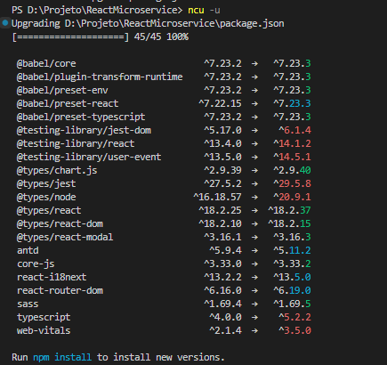

# Atualizando dependencias npm no package.json

Para atualizar as versões das dependências no arquivo package.json do seu projeto, você pode usar o npm para isso. Existem algumas maneiras de realizar esse processo:

## Atualização manual

### Identifique as dependências desatualizadas
Você pode verificar as versões mais recentes das dependências no site do npm ou executando o comando:
```
npm outdated
``` 
no terminal na pasta do seu projeto. Isso listará as dependências desatualizadas e suas versões atuais e mais recentes.

### Atualize manualmente no package.json
Abra o arquivo package.json e atualize manualmente as versões das dependências para as versões mais recentes. Por exemplo, se a versão atual de uma dependência for "express": "^4.16.4" e a versão mais recente for "express": "^5.0.0", você pode atualizar a versão para "express": "^5.0.0".

### Execute o comando npm install
Após atualizar manualmente as versões no package.json, execute npm install no terminal para instalar as versões mais recentes das dependências.

## Usando o comando npm update
O comando npm update atualiza as dependências para as versões mais recentes, mas mantém as restrições de versão definidas no package.json. Execute o seguinte comando no terminal:

```
npm update
```
Isso atualizará todas as dependências para as versões mais recentes permitidas pelas restrições de versão no package.json.

## Usando ferramentas de terceiros:
Existem ferramentas de terceiros, como npm-check-updates (ncu), que podem ajudar a automatizar esse processo. Elas podem atualizar automaticamente as versões das dependências no seu arquivo package.json. Para usar o npm-check-updates:

### Instale globalmente o npm-check-updates

```
npm install -g npm-check-updates
```
### Execute o npm-check-updates para listar as dependências desatualizadas

```
ncu
```
### Para atualizar o package.json com as versões mais recentes, execute

```
ncu -u
```
Isso atualizará o arquivo package.json com as versões mais recentes das dependências.

Após isso, basta executar o comando:
```
npm install
```
Para efetivar a instalação dos novos pacotes

### Exemplo:

